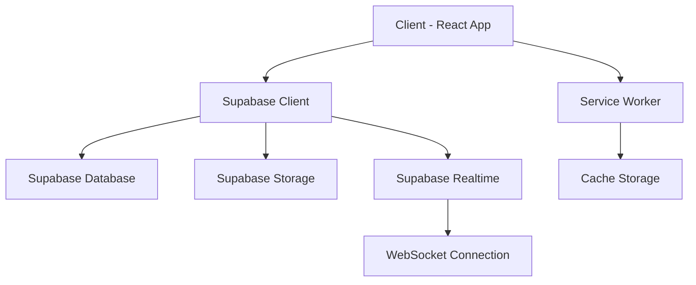
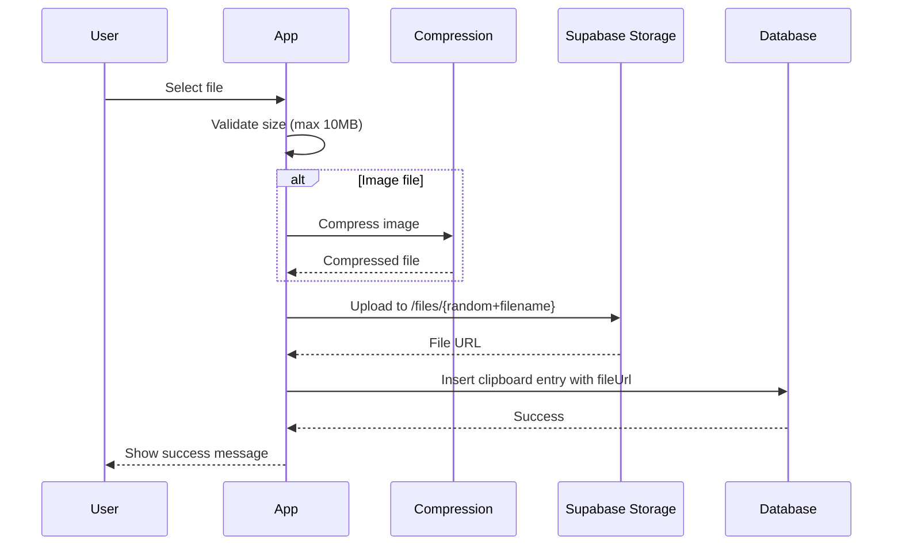

## Overview

ClipSync is built as a Progressive Web App (PWA) using a modern React architecture with real-time synchronization capabilities. The application follows a single-page application (SPA) pattern with a centralized state management approach.

## Application Architecture

The application uses a **monolithic client architecture** where all functionality is contained within a single React application. The core architecture consists of:

- **Client Layer**: React 19 application with Vite as the build tool
- **Backend Layer**: Supabase (Backend-as-a-Service) providing database, storage, and real-time features
- **PWA Layer**: Service Worker for offline functionality and app installation

### High-Level Architecture Diagram



## Component Structure

### Main Application Component

The application follows a **single-component architecture** with the main `App.jsx` component handling all functionality. This monolithic approach works well for this focused use case.

<CodeGroup>
```jsx src/App.jsx (Structure Overview)
export default function App() {
    // State Management
    const [sessionCode, setSessionCode] = useState("");
    const [clipboard, setClipboard] = useState("");
    const [history, setHistory] = useState([]);
    const [isDarkMode, setIsDarkMode] = useState(...);
    
    // Real-time sync via Supabase channels
    useEffect(() => {
        const channel = supabase
            .channel("clipboard")
            .on("postgres_changes", {...}, callback)
            .subscribe();
    }, [sessionCode]);
    
    return (
        // UI Components
    );
}
```
</CodeGroup>

Reference: `src/App.jsx:1-706`

### Key Modules

<CardGroup cols={2}>
  <Card title="Configuration" icon="gear">
    **src/config/supabase.js**
    
    Initializes Supabase client with environment variables
  </Card>
  
  <Card title="Services" icon="server">
    **src/service/doc.service.js**
    
    Session creation and management utilities
  </Card>
  
  <Card title="Utils" icon="wrench">
    **src/utils/index.js**
    
    Helper functions (link conversion, text processing)
  </Card>
  
  <Card title="File Handling" icon="file">
    **src/compressedFileUpload.jsx**
    
    Image compression before upload
  </Card>
</CardGroup>

## State Management Approach

ClipSync uses **React's built-in state management** with hooks, supplemented by React Query for server state:

### Local State (useState)

<Steps>
  <Step title="Session State">
    Manages session code and connection status
    
    ```jsx
    const [sessionCode, setSessionCode] = useState("");
    const [inputCode, setInputCode] = useState("");
    ```
  </Step>
  
  <Step title="Clipboard State">
    Handles clipboard content and file attachments
    
    ```jsx
    const [clipboard, setClipboard] = useState(
      sessionStorage.getItem("clipboard") || ""
    );
    const [fileUrl, setFileUrl] = useState(null);
    ```
  </Step>
  
  <Step title="UI State">
    Manages theme, offline status, and search
    
    ```jsx
    const [isDarkMode, setIsDarkMode] = useState(...);
    const [isOffline, setIsOffline] = useState(!navigator.onLine);
    const [searchKeyword, setSearchKeyword] = useState("");
    ```
  </Step>
</Steps>

### Server State (React Query)

Used for visitor counter management:

```jsx src/App.jsx:375-383
const { data } = useQuery({
    queryKey: ["counter"],
    queryFn: updateCounter,
    enabled: true,
    refetchOnWindowFocus: false,
    refetchOnReconnect: false,
    retry: 2,
    refetchInterval: 1000 * 60 * 5
})
```

### Persistence Strategy

<Info>
ClipSync uses multiple persistence layers:
- **localStorage**: Session codes and theme preferences
- **sessionStorage**: Temporary clipboard content
- **Supabase Database**: Persistent clipboard history
</Info>

## Real-Time Sync Architecture

### Supabase Realtime Channels

The application uses **Supabase Realtime** for instant synchronization across devices:

```jsx src/App.jsx:386-410
useEffect(() => {
    if (!sessionCode) return;
    
    const channel = supabase
        .channel("clipboard")
        .on("postgres_changes", {
            event: "*",
            schema: "public",
            table: "clipboard"
        }, (payload) => {
            if (payload.new.session_code === sessionCode && 
                payload.eventType === "INSERT") {
                setHistory((prev) => [payload.new, ...prev]);
                setClipboard("");
            }
            
            if (payload.eventType === "DELETE") {
                setHistory((prev) => 
                    prev.filter((item) => item.id !== payload.old.id)
                );
            }
        })
        .subscribe();
    
    return () => {
        supabase.removeChannel(channel);
    };
}, [sessionCode, isOffline]);
```

### How It Works

<Steps>
  <Step title="Subscribe to Changes">
    When a user joins a session, they subscribe to the `clipboard` channel
  </Step>
  
  <Step title="Database Triggers">
    Any INSERT or DELETE operation on the `clipboard` table triggers a realtime event
  </Step>
  
  <Step title="Event Filtering">
    The client filters events by `session_code` to only process relevant updates
  </Step>
  
  <Step title="State Update">
    The local history state is updated immediately, reflecting changes across all connected devices
  </Step>
</Steps>

<Warning>
Realtime connections are disabled when the device is offline to prevent connection errors. The app automatically reconnects when back online.
</Warning>

## File Storage Architecture

### Upload Flow



### Image Compression

Images are automatically compressed before upload using `browser-image-compression`:

```jsx src/compressedFileUpload.jsx:3-16
export async function compressImage(
    imageFile,
    maxSizeMB = 0.2,
    maxWidthOrHeight = 1920,
    useWebWorker = true
) {
    const options = {
        maxSizeMB,
        maxWidthOrHeight,
        useWebWorker,
    }
    
    const compressedFile = await imageCompression(imageFile, options);
    // Returns new File object with compressed data
}
```

<Info>
**Default compression settings:**
- Max size: 0.2 MB (200KB)
- Max dimension: 1920px
- Uses Web Worker for non-blocking compression
</Info>

### Storage Organization

Files are stored in Supabase Storage with the following structure:

```
clipboard/
  files/
    {3-random-chars}{original-filename}
```

The random prefix prevents filename collisions.

## Offline Handling

The application monitors online/offline status:

```jsx src/App.jsx:40-53
useEffect(() => {
    const handleOnline = () => {
        setIsOffline(false);
        setTimeout(fetchClipboardHistory, 100);
    };
    const handleOffline = () => setIsOffline(true);
    
    window.addEventListener("online", handleOnline);
    window.addEventListener("offline", handleOffline);
    
    return () => {
        window.removeEventListener("online", handleOnline);
        window.removeEventListener("offline", handleOffline);
    };
}, []);
```

<Card title="Offline Features" icon="wifi">
  - Detects network status changes
  - Shows offline banner to users
  - Automatically refetches data when back online
  - PWA caching allows viewing cached content offline
</Card>

## Database Schema

While not explicitly defined in the client code, the application interacts with these Supabase tables:

### Tables

<AccordionGroup>
  <Accordion title="sessions" icon="key">
    Stores active session codes
    
    ```sql
    - id (primary key)
    - code (unique, 5 characters)
    - created_at (timestamp)
    ```
  </Accordion>
  
  <Accordion title="clipboard" icon="clipboard">
    Stores clipboard entries
    
    ```sql
    - id (primary key)
    - session_code (foreign key to sessions)
    - content (text, max 15000 chars)
    - fileUrl (text, nullable)
    - file (json, nullable)
    - sensitive (boolean)
    - created_at (timestamp)
    ```
  </Accordion>
  
  <Accordion title="counter" icon="chart-line">
    Tracks visitor statistics
    
    ```sql
    - id (primary key)
    - total (integer)
    - unique (integer)
    ```
  </Accordion>
</AccordionGroup>

## Performance Optimizations

<CardGroup cols={2}>
  <Card title="Lazy Loading" icon="rocket">
    Service Worker caches all assets for instant loading
  </Card>
  
  <Card title="Image Compression" icon="file-zipper">
    Reduces upload size by up to 90%
  </Card>
  
  <Card title="Query Caching" icon="database">
    React Query caches visitor counter (5min refresh)
  </Card>
  
  <Card title="Efficient Updates" icon="arrows-rotate">
    Only subscribes to realtime changes when session is active
  </Card>
</CardGroup>

## Next Steps

<CardGroup cols={2}>
  <Card title="Tech Stack" icon="layer-group" href="/development/tech-stack">
    Learn about the technologies powering ClipSync
  </Card>
  
  <Card title="Local Setup" icon="laptop-code" href="/development/local-setup">
    Set up the development environment
  </Card>
</CardGroup>