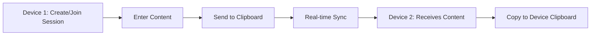

# Quick Start Guide

Get up and running with ClipSync in just a few minutes. No installation or account creation required.

## Using the Live Application

ClipSync is available at [https://clipsync.pages.dev/](https://clipsync.pages.dev/)

<Steps>
  <Step title="Open ClipSync">
    Navigate to [https://clipsync.pages.dev/](https://clipsync.pages.dev/) in your browser on your first device.
  </Step>
  
  <Step title="Create a Session">
    When you first visit, you can either:
    - Enter a session code if you already have one, or
    - Add content to the clipboard and click "Send to Clipboard" to automatically create a new session
    
    A unique 5-character session code will be generated (e.g., `A3X9K`).
    
    <Note>
      Session codes are randomly generated from uppercase letters (A-Z) and numbers (0-9).
    </Note>
  </Step>
  
  <Step title="Join the Session on Another Device">
    On your second device:
    1. Open [https://clipsync.pages.dev/](https://clipsync.pages.dev/)
    2. Enter the session code in the input field
    3. Click the **Join** button
    
    <Info>
      You can join the same session on unlimited devices simultaneously.
    </Info>
  </Step>
  
  <Step title="Sync Clipboard Content">
    Now you can sync content between devices:
    
    **To send text:**
    1. Type or paste content in the textarea
    2. Optionally mark it as "Sensitive" to mask it in history
    3. Click "Send to Clipboard"
    
    **To send files:**
    1. Click "Attach File" for documents (PDF, Word, Excel, etc.)
    2. Click "Attach Image" for images (automatically compressed)
    3. Add optional text description
    4. Click "Send to Clipboard"
    
    <Warning>
      File size limit is 10MB per file.
    </Warning>
  </Step>
  
  <Step title="Access Clipboard History">
    All synced items appear in the **Clipboard History** section below:
    
    - Click the chevron icon to expand/collapse full content
    - Click the **Copy** button to copy text to your device clipboard
    - Click the **Edit** button to modify and resend an item
    - Use the search bar to find specific items
    - Click **Delete All** to clear your session history
    
    <Tip>
      Sensitive items marked with the checkbox will show as `**********************` in the history for privacy.
    </Tip>
  </Step>
</Steps>

## Basic Workflow

Here's a typical workflow for using ClipSync:

## Additional Features

### Paste from Clipboard

Click the **Paste Text** button to automatically paste content from your device's clipboard into the textarea.

### Import Text Files

On desktop, click **Import Text File** to upload a `.txt` file directly into the textarea.

### Dark Mode

Toggle dark mode using the sun/moon icon in the top-right corner. Your preference is saved automatically.

### Offline Access

ClipSync works offline as a PWA. Your clipboard history is cached and will sync when you reconnect.

<Info>
  You'll see an offline indicator when not connected to the internet.
</Info>

### Sharing Sessions

Click the share icon in the top-right to use your device's native share functionality to send the session link to others.

## Session Management

- **Session Code**: Displayed at the top once you join/create a session
- **Leave Session**: Click the logout icon next to the session code
- **Session Persistence**: Your session is saved in localStorage and will persist across browser sessions

<Warning>
  Leaving a session will clear your local clipboard history. The data remains on the server and can be accessed by rejoining with the same session code.
</Warning>

## Tips for Best Experience

1. **Bookmark the session URL** for quick access
2. **Install as PWA** on mobile for app-like experience
3. **Use sensitive mode** for passwords and confidential data
4. **Search history** instead of scrolling through long lists
5. **Clear unused sessions** to keep your history organized

## Next Steps

<CardGroup cols={2}>
  <Card title="Installation Guide" icon="code" href="/installation">
    Set up ClipSync locally for development
  </Card>
  
  <Card title="Try It Now" icon="rocket" href="https://clipsync.pages.dev/">
    Start using ClipSync immediately
  </Card>
</CardGroup>